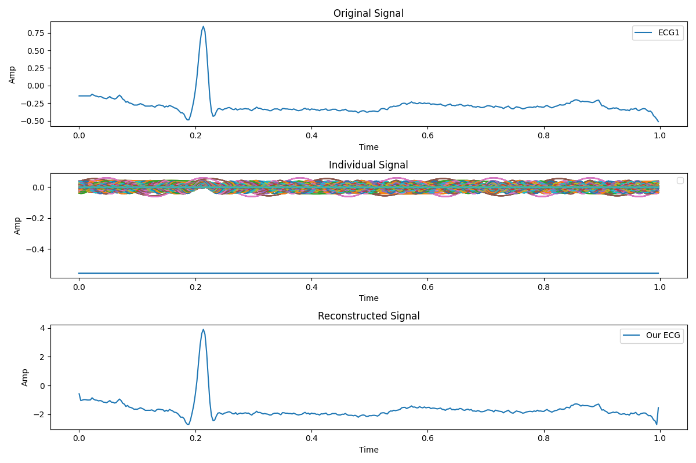
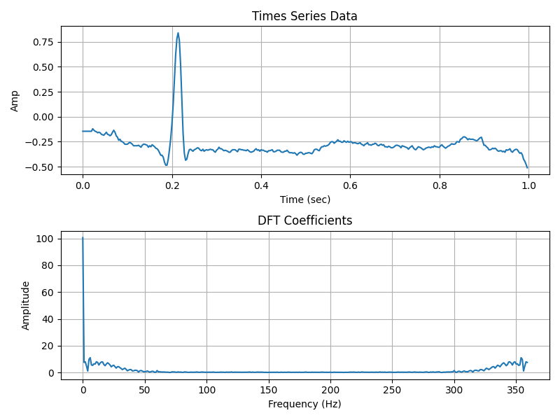
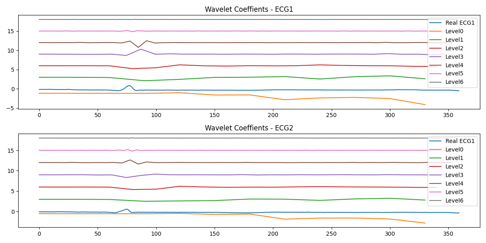
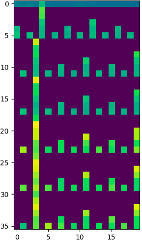

<h1 alignh="center"> ECG-QRS-Detection-with-CNN </h1>
This project focuses on developing a robust ECG QRS detection algorithm using Convolutional Neural Networks (CNN) with feature enrichment techniques. It leverages the MIT-BIH Arrhythmia database to enhance detection accuracy through advanced signal processing methods and CNN.

## Table of Contents
1. [About data](#about-data)
2. [Feature enrichmet](#feature-enrichment)
3. [Testing & Evaluation](#testing--evaluation)

## About data
[The MIT-BIH Arrhythmia Database](https://www.physionet.org/content/mitdb/1.0.0/#files-panel) is one of the most widely used and respected databases in the field of ECG signal processing and arrhythmia analysis. It contains 48 half-hour two-lead ECG recordings obtained from 47 subjects, sampled at 360 Hz. Each recording includes annotations made by cardiologists, indicating the locations and types of heartbeats (e.g., normal beats, arrhythmias, and artifacts).

records 100, 101, and 102 are used as the primary source of raw ECG signals in this project

## Feature enrichment
wavelet transform, Fourier series, and Fourier transform are applied on the data to enhance ECG signal features.

<figure align="center">

<figcaption> Fourier Series </figcaption>
</figure>

<figure align="center">

<figcaption> Fourier Transformation </figcaption>
</figure>

<figure align="center">

<figcaption> Wavelet Transformation </figcaption>
</figure>

### Signal to Image convertation

<figure align="center">

<figcaption> Wavelet Transformation.png </figcaption>
</figure>

## Testing & Evaluation

|  Criteria  |  %   |
|------------|------|
| Accuracy   | 0.96 |
| Precision  | 0.94 |
| Recall     | 0.95 |
| F1 Score   | 0.92 |

